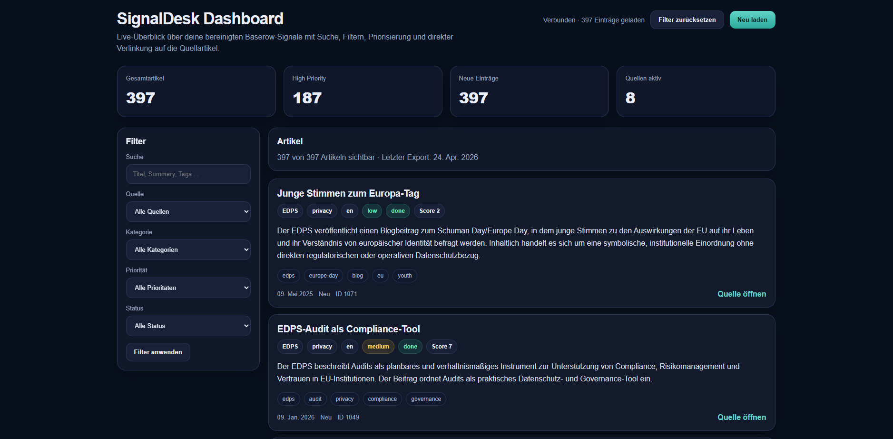

# SignalDesk

SignalDesk is a project I built to monitor regulatory, privacy, AI-policy, and cybersecurity developments across multiple public sources and bring them into one structured workflow.

The idea behind it was simple: instead of checking many different institutional websites manually, I wanted a system that collects relevant updates automatically, normalizes them into a common format, and prepares them for review, filtering, prioritization, and dashboard use.

A central part of the project is AI-assisted enrichment: in the n8n workflow, OpenAI-based processing is used to support relevance evaluation, text refinement, and downstream review preparation.

## Project goal

With SignalDesk, I wanted to build a practical monitoring pipeline for legal, regulatory, and cybersecurity signals.

The project focuses on:
- collecting updates from multiple public sources
- transforming heterogeneous source material into a structured format
- enriching items with summaries, metadata, and prioritization
- preparing the data for downstream processing in tools like Baserow and n8n
- demonstrating how AI-assisted automation can support structured monitoring workflows

For me, this project is mainly a hands-on demonstration of how I approach automation, information pipelines, AI-assisted enrichment, and structured monitoring workflows.

## What it covers

SignalDesk currently includes sources from different regulatory and cybersecurity domains, including:

- BMJ
- EDPB
- EDPS
- ENISA
- BSI
- BayLDA
- Berlin DPA
- Hessen
- EUR-Lex
- AI Act related sources

This gives the project a mix of EU-level, German federal, and German state-level monitoring sources.

## What the project does

At a high level, the workflow looks like this:

1. Scrape or collect source content from public websites and publication pages
2. Store source-specific outputs in structured files
3. Normalize records into a shared schema
4. Enrich entries with summaries, categories, tags, and relevance metadata
5. Use AI-assisted processing in n8n to support filtering, review preparation, and prioritization
6. Deduplicate and prepare the result for downstream review workflows
7. Use the cleaned data in dashboard or table-based environments

The goal was not just to scrape pages, but to create a workflow that turns raw updates into something that can actually be reviewed and acted on.

## Dashboard screenshot



## Tech stack

This project combines several tools and ideas I wanted to connect in a practical way:

- Python for scraping and processing
- requests / BeautifulSoup / feedparser for source collection
- Playwright for more dynamic or difficult pages
- JSON-based intermediate outputs
- Baserow for structured review tables
- n8n for orchestration and automation workflows
- OpenAI via n8n for relevance-related enrichment and text processing
- Docker for local workflow tooling

## Example output structure

The processed data is designed for structured review and includes fields such as:

- title
- source
- category
- language
- date
- url
- summary
- relevance score
- priority
- tags
- processing status
- error message

This makes the output more useful than a simple scrape dump, because it can be filtered, reviewed, and prioritized in a workflow-oriented way.

## Repository structure

A simplified view of the project structure looks like this:

```text
SignalDesk/
├── docker-compose.yml
├── requirements.txt
├── run_scrapers.py
├── dedupe_and_push.py
├── proxy.py
├── output/
├── log/
├── n8n_data/
└── scraper/
    ├── run_scrapers.py
    ├── scraper_baylda.py
    ├── scraper_berlin.py
    ├── scraper_bmj.py
    ├── scraper_bsi_cert.py
    ├── scraper_bsi_consumer.py
    ├── scraper_edpb.py
    ├── scraper_edps.py
    ├── scraper_enisa_news.py
    ├── scraper_enisa_publications.py
    ├── scraper_eurlex.py
    ├── scraper_hessen.py
    ├── output/
    └── log/
